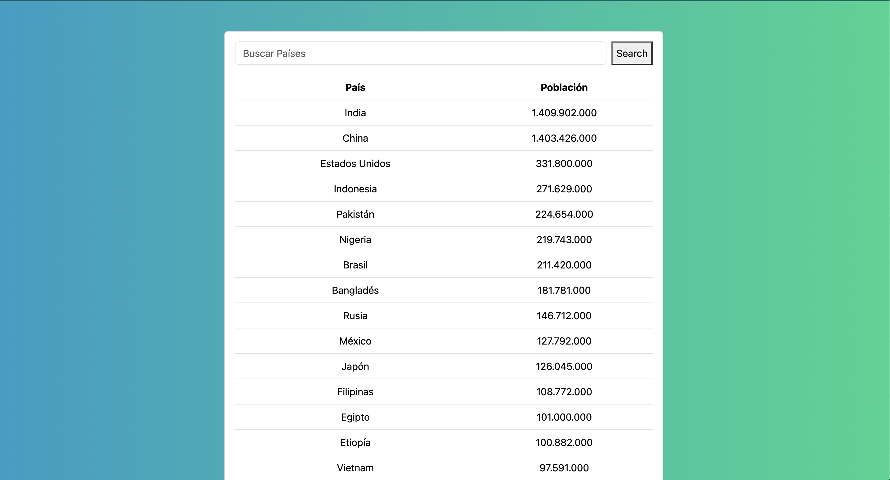
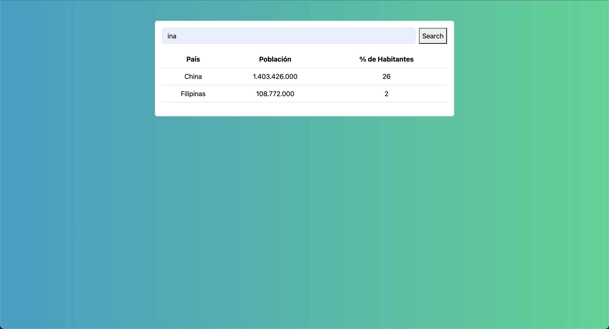
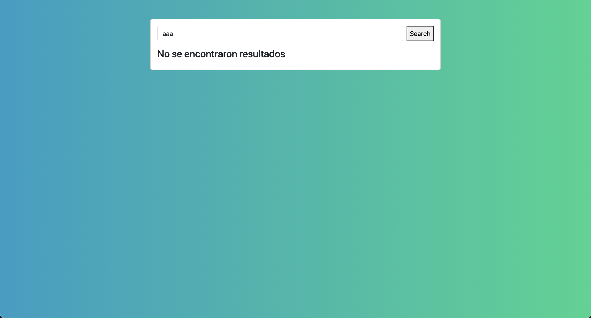

# search-countries-challenge

search-countries-challenge es una plataforma desarrollada con el stack MEAN cuyo propósito es realizar una búsqueda de países utilizando como filtro de busqueda al menos 3 caracteres (Ver Imagen 1). En caso de haber resultados con el filtro introducido en un input de busqueda, mostrará la lista resultante (hasta 5 países) con la siguiente información: Nombre del país, Población y Porcentaje de Habitantes sobre la suma total de la población de cada país (Ver Imagen 2). En caso de no encontrar resultados se mostrará "No se encontraron resultados" (Ver Imagen 3).





## Requisitos Previos

Para levantar correctamente este proyecto se requieren minimamente los siguientes requisitos:

- [Node.js v>=20](https://nodejs.org/)
- [pnpm v>=8]: `npm install -g pnpm` o visita el sitio oficial de [pnpm](https://pnpm.io/) para otras alternativas de instalación.
- [Angular v16](https://v16.angular.io/guide/setup-local#install-the-angular-cli): `npm install -g @angular/cli@16`
- Cuenta en [MongoDB Atlas](https://www.mongodb.com/cloud/atlas) (o una instancia local de MongoDB)

## Estructura del Proyecto

search-countries-challenge es un monorepo que contiene las siguientes carpetas:

- `server/`: Contiene el código del servidor Express.js.
- `client/`: Contiene el código de la aplicación Angular.

Este monorepo también contiene los siguientes archivos:

- `pnpm-workspace.yaml`: este archivo contiene los nombres de cada paquete para que se pueda gestionar desde este unico paquete raíz de nivel superior.
  (Para más info acerca de workspaces y como los maneja pnpm visitar: [PNPM-WORKSPACE](https://pnpm.io/es/workspaces))
- `package.json`: este archivo contiene entre otras cosas las dependencias compartidas como así también los scripts para ejecutar los scripts de cada proyecto individualmente y scripts para ejecutar los proyectos conjuntamente.

## Instalación

1. Clona el repositorio: `git clone https://github.com/darag5/search-countries-challenge.git`
2. Navega hacia el directorio de la aplicación: `cd search-countries-challenge`
3. Instala dependencias: `pnpm install`

## Configuración

1. Crea un archivo `.env` en el directorio server.
2. Abre el archivo `.env` y setear las siguientes variables de entorno con tus datos:

   ```env
   # Archivo .env

   # Configuración de MongoDB Atlas
   MONGODB_URI=your_mongodb_uri_here

   # Configuración del servidor Express
   PORT=3000
   ```

## Ejecución

1. Si es la primera vez que inicia el proyecto, ejecuta las migraciones: `pnpm migrate:up`
2. Inicia la aplicación: `pnpm dev`
3. Visita `http://localhost:4200` en tu navegador.

## Migraciones de Base de Datos

Este proyecto utiliza la dependencia [migrate-mongo](https://www.npmjs.com/package/migrate-mongo) para gestionar cambios en la base de datos. A continuación, se describen los pasos para ejecutar y gestionar migraciones.

### Requerimientos mínimos

1. Se requiere tener las configuraciones de base de datos actualizadas en el archivo `.env`.

   ```env
   # Archivo .env

   # Configuración de MongoDB Atlas
   MONGODB_URI=your_mongodb_uri_here

   ```

2. Se requiere tener la dependecia instalada
   `pnpm install`

### Ejecutar Migraciones

- **Genera nuevo archivo de migración:** `pnpm migrate-mongo create nombre_migracion`
- **Ejecutar las migraciones:** `pnpm migrate-mongo up`
- **Deshacer las migraciones:** `pnpm migrate-mongo down`

## Ejecutar Tests

## Licencia

Este proyecto está licenciado bajo la [Licencia MIT](LICENSE).

## Contacto

- Autor: Delma Araceli Gonzalez
- Correo Electrónico: ara.gonzalez92@gmail.com
